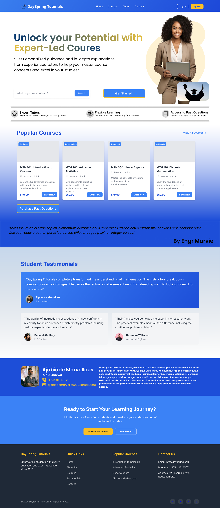
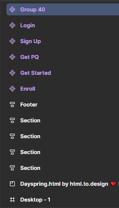

# 🎓 University Tutorial Platform – UI/UX Design

This project showcases a **UI/UX design** for a digital platform that simplifies how university students:

- 📘 Buy Past Questions (PQs)  
- 📝 Register for Tutorials  
- 💳 Pay Tutorial Fees  
- 🗓️ View Tutorial Schedules  
- 📨 Receive Notifications & Reminders

---

## 🎨 Design Focus

The design prioritizes:

- 🔹 **User-friendliness** – Clean, modern, and intuitive interface  
- 🔹 **Accessibility** – Easy navigation for both tech-savvy and non-tech users  
- 🔹 **Efficiency** – Minimal steps to complete each task  
- 🔹 **Mobile-First Approach** – Optimized for mobile users  

---

## 🛠️ Tools Used

- 📐 Figma – For wireframes and high-fidelity mockups  
- 🖌️ Canva – For visual elements  
- 📁 Adobe XD *(optional)* – If used for prototyping  
- 🧠 Notion/Miro – For user flow and planning (if applicable)

---

## 📷 Screenshots

> This is a screenshot of the design:

*Home screen with options for buying PQs and registering for tutorials*

---

## 📁 Folder Structure

> This is the structure of the design:

---
